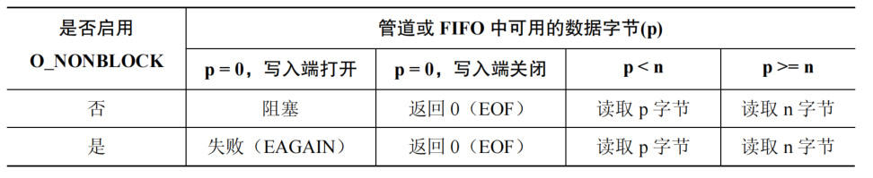

# 6. 管道与FIFO

管道与 FIFO 是 UNIX 系统上最古老的 IPC 方法。FIFO 是管道的一个变体，可用于任意进程间的通信。

### 管道

#### 概述

管道可看作一个单向字节流，管道两端分别为一个读进程和一个写进程。管道有以下特点：

* 管道是单向的字节流，意味着管道不存在消息边界的概念，不能随机访问数据，只能每次顺序读取任意大小的数据块，读取后管道内便不存在此数据。
* 管道可以确保写入不超过 PIPE\_BUF 字节的操作是原子的。这可以保证多个进程写入时，只要数据大小不超过 PIPE\_BUF 则数据不会混合。Linux 上，PIPE\_BUF 的值为 4096。
* 管道的容量是有限的，读数据的进程应该被设计成可以尽可能快地读取数据。

#### 创建和使用管道

```c
#include <unistd.h>
// 创建管道，返回两个打开的文件描述符 filedes[0] filedes[1]，分别为读取端和写入端
// 成功返回 0，失败返回 -1
// 因为是文件描述符，可以使用 read write 调用在管道上执行 IO
int pipe(int filedes[2]);
```

管道一般用于父子进程通信，子进程会继承父进程的文件描述符。因为其是单向的，所以父子进程需要明确读写的角色，并把自己不需要的文件描述符关闭。 关闭未使用的管道描述符可以防止耗尽文件描述符的限制。 从管道中读取数据的进程会关闭其持有的管道的写入描述符，这样当其他进程完成输出并关闭其写入描述符之后，读者就能够看到文件结束（在读完管道中的数据之后），否则 read 会一直阻塞进程。 当一个进程试图向一个管道中写入数据但没有任何进程拥有该管道的打开着的读取描述符时，内核会向写入进程发送 一个 SIGPIPE 信号，默认情况下该信号会杀死进程。所以在实际中一般会忽略 SIGPIPE 信号，而通过 write 调用返回的 EPIPE 错误来获取管道状态。

### FIFO

FIFO 与管道是类似的，FIFO 在文件系统中拥有一个名称，所以也称为命名管道，可用于非相关进程之间的通信。上面管道介绍的一些特性同样适用与 FIFO。 与管道一样，当所有引用 FIFO 的描述符都被关闭之后，所有未被读取的数据会被丢弃。

```c
#include <sys/stat.h>
// 创建一个命名管道，此命令还是一个 Linux 命令：
// mkfifo [ -m mode ] pathname
// 在不使用此 FIFO 后调用 unlink 删除此文件
// 成功返回 0，失败返回
int mkfifo(const char *pathname, mode_t mode);
```

其中的 mode 与文件权限一致，可取：

```
S_IRUSR：用户读权限
S_IWUSR：用户写权限
S_IXUSR：用户执行权限
S_IRGRP：组读权限
S_IWGRP：组写权限
S_IXGRP：组执行权限
S_IROTH：其他用户读权限
S_IWOTH：其他用户写权限
S_IXOTH：其他用户执行权限
```

上面的值可以取 OR 运算指定，这些权限会按进程的 umask 值来取掩码。具有合适权限的任何进程都可以打开 FIFO。 一旦创建好 FIFO 后，就可以像一个普通文件一样打开它，然后与管道一样操作它。打开一个 FIFO 时需要为其设置一个读取进程与写入进程。在默认情况下，打开一个 FIFO 读取数据（open 函数 O\_RDONLY 标记）将会阻塞直到另一个进程打开 FIFO 以写入数据（open 函数 O\_WRONLY 标记）。如果想取消此阻塞，则在 open 调用中添加 O\_NOBLOCK 标记。

<figure><figcaption></figcaption></figure>

&#x20;从一个包含 p 字节的管道或 FIFO 中读取 n 字节的语义如下：

<figure><figcaption></figcaption></figure>

&#x20;向一个管道或 FIFO 写入 n 字节的语义如下：

&#x20;

<figure><figcaption></figcaption></figure>

下面是一个利用 FIFO 通信的例子，客户端将命令行的数据发送给服务端，服务端将发送来的字符串转为大写后发送回去：&#x20;

辅助头文件：

```c
// fifo_info.h  包装了读写函数和消息结构
#include <sys/stat.h>
#include <unistd.h>
#include <limits.h>
#include <stdio.h>

// 服务端 接收客户端信息
#define FIFO_SERVER "./fifo_server.fifo"
// 客户端 给服务端发送信息，这里只有一个客户端所以写死了，多个客户端可以设计一种命名约定（用 PID 标识）
#define FIFO_CLIENT "./fifo_client.fifo"

#define BUF_SIZE (PIPE_BUF - sizeof(int))


typedef struct {
    int length;
    char buf[BUF_SIZE];
} Message;

// 从 fd 中读取数据存入 msg
int read_fifo(int fd, Message *msg) {
    if(read(fd, &(msg->length), sizeof(msg->length)) == -1) {
        perror("Read Message Length Error!");
        return -1;
    }
    if(read(fd, msg->buf, msg->length) == -1) {
        perror("Read Message Buf Error!");
        return -1;
    }
    return 0;
}

// 向 fd 写入消息
int write_fifo(int fd, const Message *msg) {
    if(write(fd, &msg->length, sizeof(msg->length)) == -1) {
        perror("Write Message Length Error!");
        return -1;
    }
    if(write(fd, msg->buf, msg->length) == -1) {
        perror("Write Message Buf Error!");
        return -1;
    }
    return 0;
}
```

服务端：

```c
// fifo_server.c FIFO 服务器，将客户端的字符串转为大写
#include <signal.h>
#include <fcntl.h>
#include <ctype.h>

#include "fifo_info.h"

int main() {
    if(mkfifo(FIFO_SERVER, S_IRUSR | S_IWUSR | S_IRGRP | S_IWGRP) != 0) {
        perror("Make FIFO_SERVER Error.");
        return -1;
    }
    
    int fd = open(FIFO_SERVER, O_RDONLY);
    // 使其阻塞，否则后面的 read 会返回 EOF
    int fd2 = open(FIFO_SERVER, O_WRONLY);
    Message msg;
    setbuf(stdout, NULL);

    while(1) {
        // 读取数据
        if(read_fifo(fd, &msg) != 0) {
            return -1;
        }
        // 改为大写
        for(int i = 0;i < msg.length;++i) {
            msg.buf[i] = toupper(msg.buf[i]);
        }
        // 打开客户端 FIFO 发送数据
        int fd_c = open(FIFO_CLIENT, O_WRONLY);
        if(fd_c < 0) {
            perror("Open Client FIFO Error.");
            return -1;
        }
        if(write_fifo(fd_c, &msg) != 0) {
            return -1;
        }
        close(fd_c);
    }

    return 0;
}
```

客户端：

```c
// fifo_client 客户端 将命令行数据发送给服务器
#include <signal.h>
#include <fcntl.h>
#include <string.h>

#include "fifo_info.h"

int main(int argc, char *argv[]) {
    if(mkfifo(FIFO_CLIENT, S_IRUSR | S_IWUSR | S_IRGRP | S_IWGRP) != 0) {
        perror("Make FIFO_CLIENT Error.");
        return -1;
    }
    setbuf(stdout, NULL);
    int fd_server = open(FIFO_SERVER, O_WRONLY);
    Message msg;

    for(int i = 1;i < argc;++i) {
        msg.length = strlen(argv[i]);
        memcpy(msg.buf, argv[i], msg.length);

        // 发送数据
        if(write_fifo(fd_server, &msg) != 0) {
            return -1;
        }

        int fd_client = open(FIFO_CLIENT, O_RDONLY);
        if(read_fifo(fd_client, &msg) != 0) {
            return -1;
        }
        close(fd_client);

        write(STDOUT_FILENO, msg.buf, msg.length);
        printf("\n");
    }

    close(fd_server);

    return 0;
}
```

运行结果：

```
❯ ./fifo_server&
[1] 5555
❯ ./fifo_client hello world linux
HELLO
WORLD
linux
```
